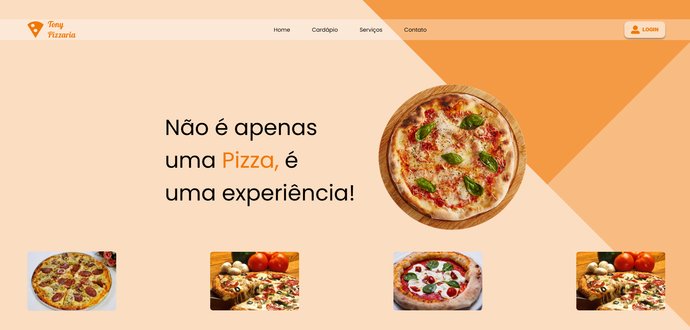

# TONY-PIZZARIA

Projeto feito durante as aulas de Linguagens de Marcação na escola Senai Jandira. 
O site foi desenvolvido criando boas práticas, como por exemplo tags semânticas e responsividade.

## Tecnologias

* HTML
* CSS
* Media Queries

## Autor
[Enzo Carrilho](<https://www.linkedin.com/in/enzo-carrilho/>)
